# Käserkuchen

## Zutaten

### Hauptmasse

* 4 Eier, Eigelb (optional)
* 1 kg Quark
* 60 g Stärke
* 1 Limette
* 150 ml Öl (zB Maiskeimöl)
* 2 Vanilleschoten
* 500 ml Milch
* 150 g Zucker

### Baiser (optional)

* 4 Eier, Eiweiß
* 100 g Zucker
* 1 EL Kakao

### Mürbeteigboden

* 75 g Zucker
* 75g Butter
* 1 Ei, ganz (oder Ei-Ersatz)
* 1 TL Backpulver
* Prise Salz
* 200g Mehl
* Springform

## Zubereitung

### Hauptmasse

1. 1 kg Quark, 150g Zucker, 60g Stärke, 150ml Öl vermischen
2. 4 Eier trennen, Eigelb zur Masse geben, Eiweiß aufbewahren
2. 1 Limette auspressen, Saft zur Masse geben
3. 2 Vanilleschoten auskratzen, vermengen
4. 500 ml Milch unter Rühren zur Masse geben

### Mürbeteigboden

1. 75g Zucker, 1 Ei, 1 TL Backpulver, 200g Mehl vermengen
2. 75g Butter zu Flocken schneiden, in Teigmasse kneten
3. Springform fetten
4. Teig auf Boden und Ränder verteilen

### Baiser

1. 4 Eiweiß aufschlagen
2. 100g Zucker beim Schlagen einrieseln
3. 1 EL Kakao einrühren

### Kuchen

1. Teigmasse in Springform füllen
2. ca 45 min bei 200C (Umluft) backen, derweil Baiser vorbereiten
3. Baiser auftragen, weitere 15 min bei 150C backen

```mermaid
gantt
title Käserkuchen
dateFormat HH:mm
axisFormat %H:%M

section Oven
	Vorheizen auf 200C (Umluft): preheat, 0, 15m 

section Mürbeteigboden
	75g Zucker: crustsugar, 0, 0m
	1 Ei: crustegg, 0, 0m
	1 TL Backpulver: crustbakingpowder, 0, 0m
	200g Mehl: crustflour, 0, 0m
	Zutaten mischen: crustmix, after crustsugar crustegg crustbakingpowder crustflour, 2m
	75g Butter: butter, 0, 0m
	Butter zu flocken schneiden: crustbutter, after butter, 3m
	Butter in Mischung einkneten: crustknead, after crustbutter crustmix, 5m
	Springform einfetten: crustfat, 0, 2m
	Bodenmasse in Springform verteilen: crustapply, after crustknead crustfat, 5m
	Vorbacken 10m: crustbake, after crustapply preheat, 10m

section Hauptmasse
	1kg Quark: quark, 0, 0m
	150g Zucker: zucker, 0, 0m
	60g Stärke: staerke, 0, 0m
	150ml Öl: oel, 0, 0m
	4 Eier: eier, 0, 0m
	Eier trennen: eiertrennen, after eier, 5m
	4 Eigelb: eigelb, after eiertrennen, 0m
	1 Limette: limette, 0, 0m
	Limette auspressen: limettepressen, after limette, 3m
	2 Vanilleschoten: vanille, 0, 0m
	Vanille auskratzen: vanillemark, 0, 3m
	Zutaten vermischen: hauptmasse1, after quark zucker staerke oel eigelb limettepressen vanillemark, 5m
	500ml Milch: milch, 0, 0m
	Milch in Masse einrühren: hauptmasse2, after milch masse, 5m
	
	4 Eiweiss aufheben: eiweiss, after eiertrennen, 0m

section Baiser (optional)
	100g Zucker: baiserzucker, 0, 0m
	1 EL Kakao: kakao, 0, 0m
	Eiweiss aufschlagen, Zucker einrieseln, Kakao einrühren: eischnee, after eiweiss baiserzucker kakao, 5m

section Kuchen
	Teigmasse in vorbereitete Springform mit Boden füllen: kuchen1, after crustbake hauptmasse2, 2m
	Kuchen ca 45 min bei 200C (Umluft) backen: kuchen2, after hauptmasse2 kuchen1, 45m
	Baiser auftragen: kuchen3, after kuchen2, 5m
	Kuchen weitere 15m bei 150C backen: kuchen4, after kuchen3, 15m
```

