Lightly adapted recipe from [Cooking for Engineers](https://www.cookingforengineers.com/recipe/65/Pumpkin-Pie)
- pie crust from scratch
- raw pumpkin instead of canned
- sugar in custard reduced by 25%

```mermaid

gantt
title Pumpkin pie
dateFormat HH:mm
axisFormat %H:%M

section Oven
	preheat to 200C (convection): preheat, 0, 15m 
section Crust
	75g sugar: crustsugar, 0, 0m
	1 egg: crustegg, 0, 0m
	1 tsp baking powder: crustbakingpowder, 0, 0m
	200g flour: crustflour, 0, 0m
	mix: crustmix, after crustsugar crustegg crustbakingpowder crustflour, 2m
	75g butter: butter, 0, 0m
	cut butter to flakes: crustbutter, after butter, 3m
	knead butter into mix: crustknead, after crustbutter crustmix, 5m
	apply fat to pie form: crustfat, 0, 2m
	apply crust to pie form: crustapply, after crustknead crustfat, 5m
	bake blind 10m: crustbake, after crustapply preheat, 10m
section Custard
	450g raw pumpkin: pumpkin, 0, 0m
	steam pumpkin ca 10m: pumpkinsteamed, after pumpkin, 10m
	
	2g ground cinnamon: cinnamon, 0, 0m
	1g ground ginger: ginger, 0, 0m
	1g ground nutmeg: nutmeg, 0, 0m
	0.5g ground cloves: cloves, 0, 0m
	3g salt: salt, 0, 0m
	150g dark brown sugar: custardsugar, 0, 0m
	180ml whole milk: milk, 0, 0m
	180ml heavy cream: cream, 0, 0m
	combine: combine, after pumpkinsteamed cinnamon ginger nutmeg cloves salt custardsugar milk cream, 5m
	3 eggs: custardeggs, 0, 0m
	blend eggs until creamy: blendedeggs, after custardeggs, 3m
	blend combined ingredients with eggs: custardall, after blendedeggs combine, 5m
section Pie
	pour custard in prepared crust: pourpie, after preheat crustbake custardall, 1m
	bake at 200C for 25m: bakedpie, after pourpie, 25m

```

